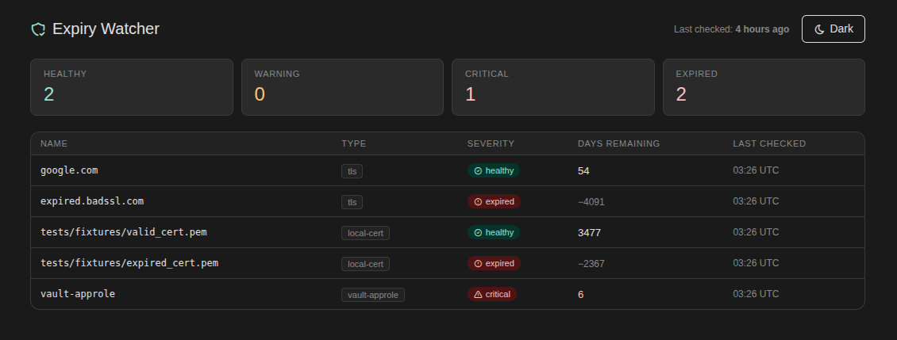

# Expiry Watcher



[](https://github.com/igalhub/expiry-watcher/actions/workflows/ci.yml)

A systemd-timer-driven monitoring tool that detects TLS certificates, local cert files, and Vault credentials approaching expiry, and presents results via a read-only status dashboard.

---

## What this is

Expiring certificates and credentials fail silently: they work perfectly until the moment they don't. This project demonstrates a monitoring pattern for catching them early, built around two architectural decisions that matter in production:

- The **checker** and **dashboard** are separate processes. A dashboard crash doesn't stop checks from running; a checker failure doesn't hide the last-known state.
- Check results are persisted to SQLite with a timestamp, so the dashboard can honestly report when data is stale — not just whether the monitored assets are healthy.

---

## Architecture

```
systemd timer (every 6 hours)
  └── python -m checker.check
        ├── tls_checker.py     — remote TLS endpoints (ssl + socket, stdlib)
        ├── local_cert_checker.py — cert files on disk (cryptography library)
        ├── vault_checker.py   — Vault AppRole / token TTL (hvac)
        └── writes results + timestamp → results.db (SQLite)

uvicorn / docker compose (dashboard — separate process)
  └── dashboard/main.py  — READ-ONLY against results.db, never writes
        ├── GET /status  — JSON: all items + days_remaining + severity + stale flag
        └── GET /        — HTML table, color-coded by severity, staleness banner
```

**Why two processes?** If the checker and dashboard ran in the same process, a dashboard crash would silently stop checks — the exact failure mode this tool exists to catch. Splitting them means:

- The dashboard can crash and restart without losing check history.
- The checker can fail without taking down visibility into the last known state.
- The dashboard's own staleness (data older than 2× the check interval) is surfaced honestly rather than hidden behind a process that's still "up."

**Severity thresholds:** healthy (> 30 days), warning (8–30 days), critical (1–7 days), expired (≤ 0 days).

---

## Setup

**Prerequisites:** Python 3.12, Docker (for the dashboard container), a running [Vault Secrets Demo](https://github.com/igalhub/vault-secrets-demo) instance for Vault checks.

```bash
git clone git@github.com:igalhub/expiry-watcher.git
cd expiry-watcher
python3 -m venv .venv
source .venv/bin/activate
pip install -r requirements.txt
```

### Configure targets

```bash
cp config/targets.yaml.example config/targets.yaml
```

Edit `config/targets.yaml` — add TLS endpoints and local cert paths. The vault URL (`http://localhost:8200`) is already in the example; credentials go in a separate gitignored file (see below).

### Configure Vault credentials

Create the short-TTL test AppRole in your running Vault instance:

```bash
export VAULT_TOKEN=<root-token>
bash scripts/vault_setup_test_role.sh
```

The script prints a `role_id` and `secret_id` to stdout, then — for the
`secret_id`-TTL check (EW-014) — a second, clearly separated block with
`role_name`, a fresh short-TTL `secret_id`, and a `lookup_token`. The
`lookup_token` is a distinct credential from the `role_id`/`secret_id`
login pair: it's a narrowly-scoped Vault token (policy grants only
`update` on that role's `secret-id/lookup` path), used to read the
`secret_id`'s own remaining TTL without performing a login. Copy both
blocks into `config/vault.yaml` (gitignored, never committed):

```bash
cp config/vault.yaml.example config/vault.yaml
# then edit config/vault.yaml and fill in role_id, secret_id, role_name,
# lookup_token (token is optional — see config/vault.yaml.example)
```

### Install the systemd timer (Linux only)

```bash
bash systemd/install.sh
```

This copies `expiry-watcher.service` and `expiry-watcher.timer` to `~/.config/systemd/user/`, reloads the daemon, and enables and starts the timer. The checker runs 5 minutes after boot and then every 6 hours. The unit file assumes the repo is cloned to `~/claudecode/projects/expiry-watcher` (via systemd's `%h` specifier) — edit the paths in `expiry-watcher.service` if you've cloned it elsewhere.

---

## Running the checker

**One-shot (from the project root):**

```bash
python -m checker.check
```

Note: the checker must be invoked as `python -m checker.check` from the project root — not `python checker/check.py`. The `-m` flag sets up the correct import path for the `checker` package.

**Via systemd (after install):**

```bash
# Trigger a manual run immediately:
systemctl --user start expiry-watcher.service

# Check the log:
journalctl --user -u expiry-watcher.service

# Check timer status:
systemctl --user status expiry-watcher.timer

# Stop future scheduled runs:
systemctl --user stop expiry-watcher.timer
```

---

## Running the dashboard

The dashboard reads `results.db`. Run the checker at least once first to create it.

**Docker (recommended):**

```bash
python -m checker.check          # creates results.db on the host
docker compose up dashboard      # mounts results.db read-only into the container
```

Dashboard is available at **http://localhost:8080**. It supports dark and light mode (defaulting to dark); preference is saved in `localStorage` across sessions.

The docker-compose volume mount (`./results.db:/app/results.db:ro`) binds the exact file the systemd checker writes to. The `:ro` flag enforces read-only at the container level, not just in application code.

**Direct (no Docker):**

```bash
uvicorn dashboard.main:app --host 0.0.0.0 --port 8080
```

---

## Running tests

**Offline suite (no network, no Vault — what CI runs):**

```bash
pytest -m "not network and not vault" -v
```

**Live TLS tests** (requires internet access):

```bash
pytest -m network -v
```

Includes a test against `expired.badssl.com` that asserts `severity == "expired"` — proving the detector fires correctly on a real expired certificate, not just that it runs without error.

**Live Vault tests** (requires running Vault instance and `config/vault.yaml`):

```bash
pytest -m vault -v
```

Tests skip automatically with a clear message if Vault is not reachable or is sealed.

---

## Platform support

| Component | Linux | macOS | Windows |
|---|---|---|---|
| Checker (`checker/`) | Tested | Likely works, untested | Likely works, untested |
| Dashboard (`dashboard/`) | Tested | Likely works, untested | Likely works, untested |
| systemd timer | Tested | Not supported | Not supported |
| Docker dashboard | Tested | Likely works, untested | Likely works, untested |

Development and testing was done on Linux (Ubuntu, Python 3.12). The systemd units are Linux-only; on other platforms, use cron or a task scheduler as an alternative to automate `python -m checker.check`.

**Home lab (Proxmox VE + Ubuntu Server 24.04.3 VM):** Fully tested —
all components work as-is. Note that `python3.12-venv` must be
installed explicitly (`sudo apt install -y python3.12-venv`) as it is
not included by default on Ubuntu Server. See
`docs/HOMELAB_DEPLOYMENT.md` for the full walkthrough.

---

## What's not in scope

**AWS IAM key age checking** is tracked as EW-012 (stretch ticket) and is explicitly deferred until real AWS credentials are available for testing. A checker that has never actually been run against an AWS key is unproven. This is documented here rather than hidden so it's clear the omission is deliberate.

**Push notifications** (email, Slack, PagerDuty) are not in v1. The dashboard is the only alerting surface. The SQLite schema stores enough history to support a notification layer in v2.

**Historical trend graphs** — the dashboard shows current state with a staleness indicator. SQLite stores all check history from day one (the schema supports it), but rendering trends is out of scope for v1.

**OAuth refresh token expiry** — no clean generic check mechanism; excluded entirely.
